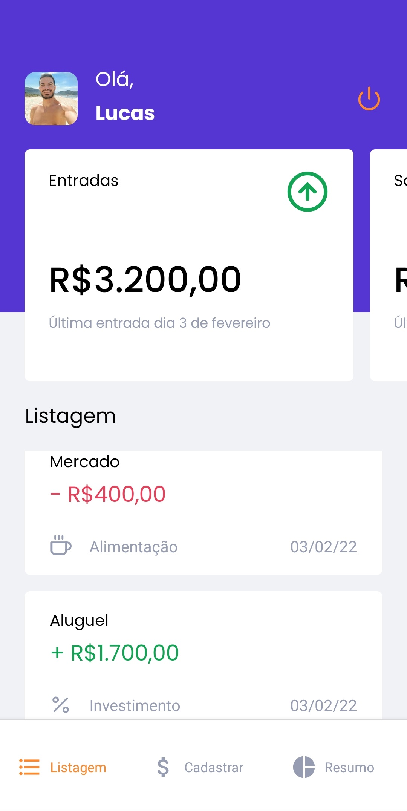
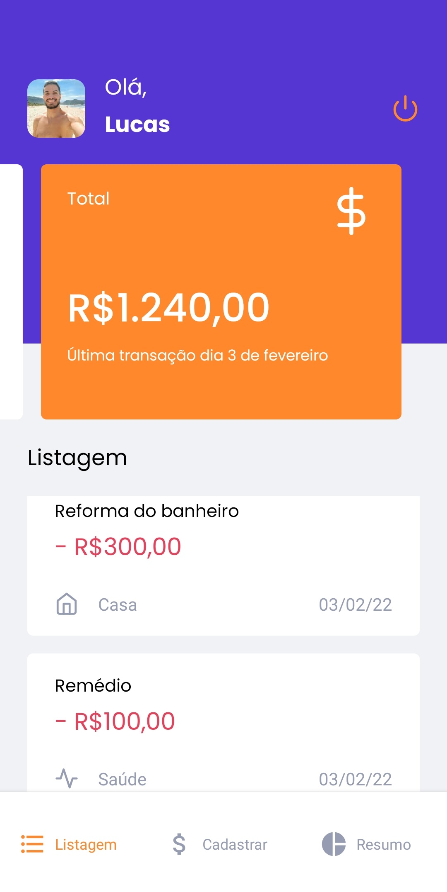
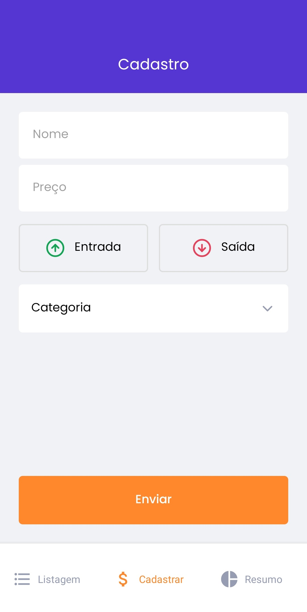
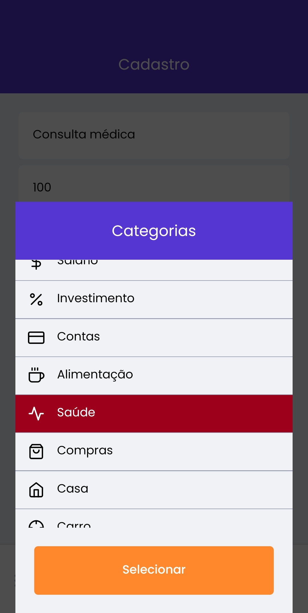
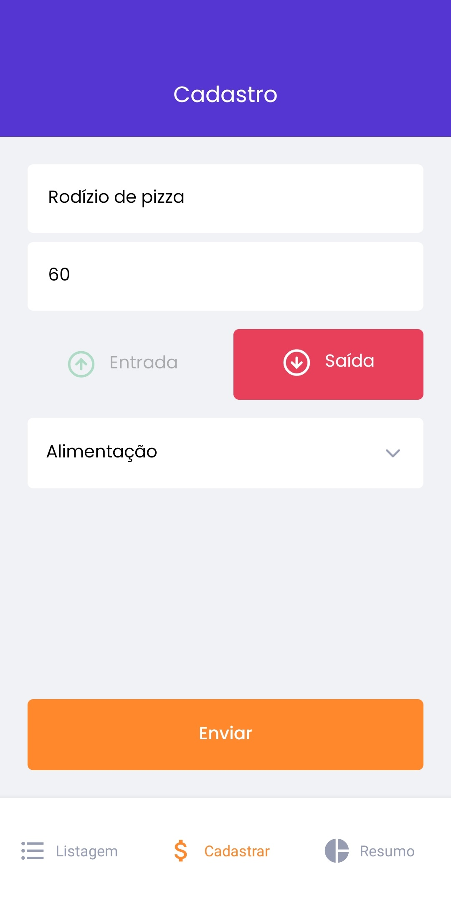
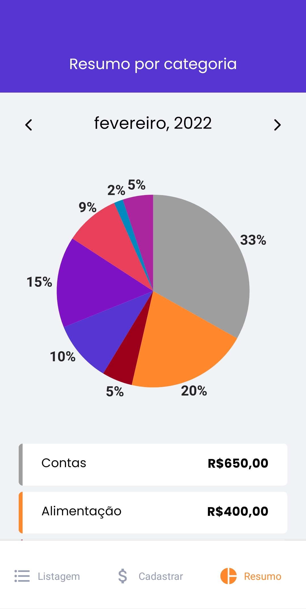
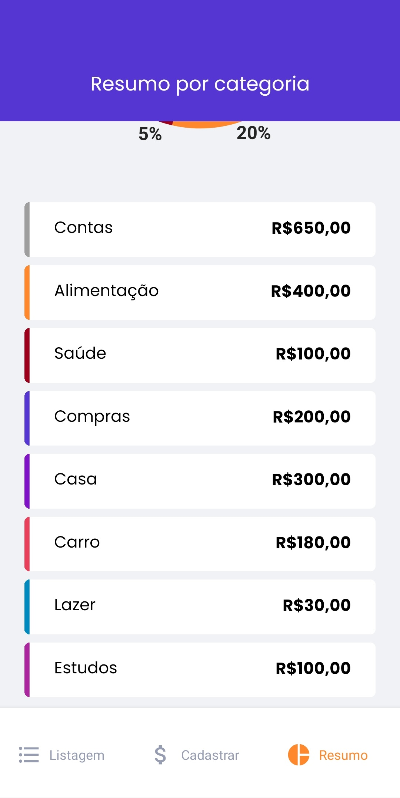

# 💵 GoFinances
  
 
  

## 💡 Tecnologias

- OAuth2
- AsyncStorage

## 📝 Projeto
GoFinances é um app de controle financeiro em que você pode cadastrar transações de entrada e de saída e avaliar a movimentação financeira durante o mês. Possui várias categorias para você poder analisar em quais estão os maiores gastos.
